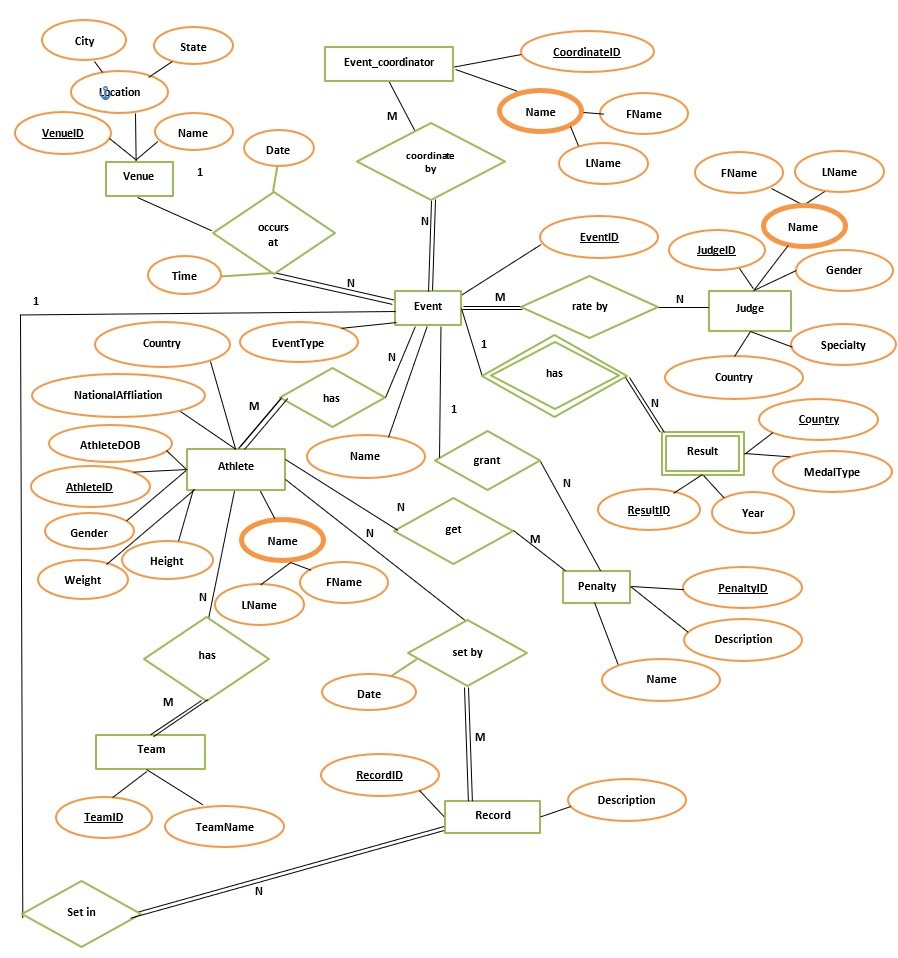
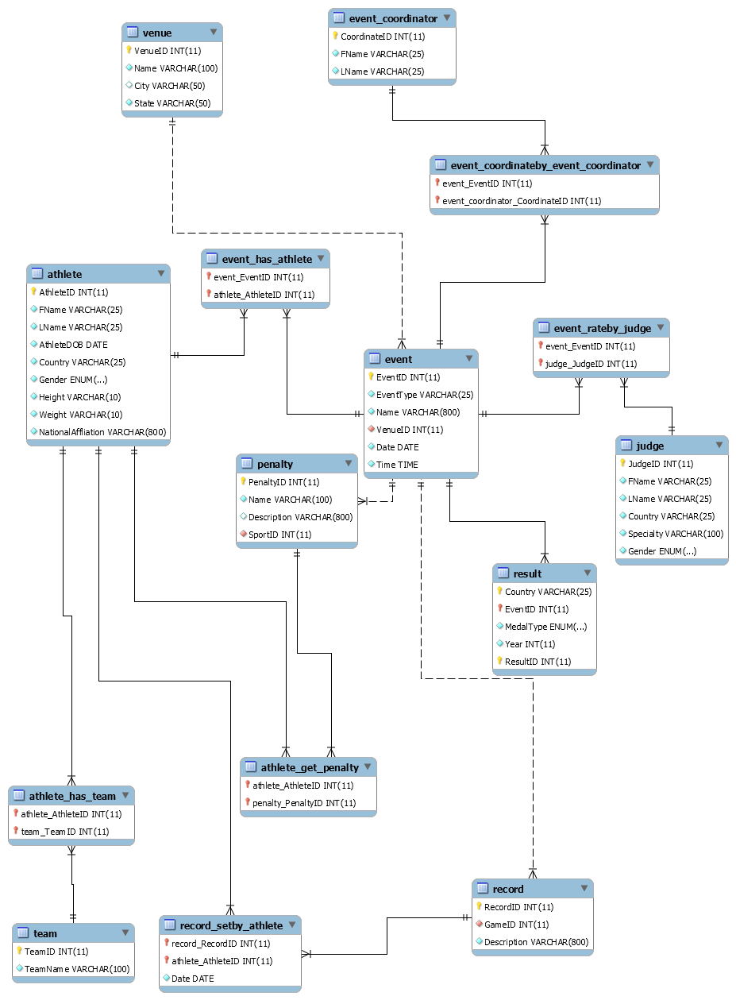

<h1 align="center">Olympic Games Database</h1>

<p align="center">
  
</p>

## Overview

This project implements a relational **Olympic Games Database** using **MySQL / MariaDB**, developed as part of an academic database systems assignment.  
It includes the full database schema, data population scripts, ER modeling artifacts, and representative SQL queries.

The repository is intentionally kept **clean and minimal**, containing only source files and visual documentation required to understand and reproduce the database.

---

## Project Structure

```
/
├── images/
│ ├── OG.png
│ ├── DB.png
│ ├── neo.jpg
│ └── olympicsdbER.png
│
├── sql/
│ ├── data/
│ │ └── olympicsdbDump.sql
│ │
│ ├── queries/
│ │ ├── query1.sql
│ │ ├── query2.sql
│ │ ├── query3.sql
│ │ └── query4.sql
│ │
│ ├── olympicdb_model.mwb
│ └── users.sql
│
└── README.md
```

---

## Database Scope

The database models core Olympic Games entities, including:

- Athletes and teams
- Events, venues, and coordinators
- Judges and penalties
- Results, records, and medals
- Many-to-many relationships via junction tables
- SQL views for higher-level information retrieval

<h2>
  
  ER &amp; Conceptual Modeling
</h2>


### Conceptual ER Diagram (Initial Design)

The following diagram represents the **conceptual ER model**, focusing on entity relationships and cardinalities.

<p align="center">

</p>

### Logical ER Diagram (Relational Schema)

The logical ER diagram reflects the **final relational schema**, including primary keys, foreign keys, and normalization decisions.

<p align="center">

</p>

## SQL Implementation

### Schema & Data Initialization

The complete database schema **and data population** are contained in:

`sql/data/olympicsdbDump.sql`

To initialize the database:

`SOURCE path/to/olympicsdbDump.sql;`

This script:

- Drops and recreates the schema

- Creates all tables and constraints

- Inserts representative dataset records

- Defines SQL views for reporting queries

MySQL Workbench Model

The file below contains the full visual database model (tables, relationships, constraints):

`sql/olympicdb_model.mwb`

This file can be opened directly with MySQL Workbench.

## Queries

The queries/ directory contains standalone SQL queries demonstrating:

- Multi-table joins
- Aggregations and filtering
- View-based querying
- Realistic database use cases

sql/queries/
- query1.sql
- query2.sql
- query3.sql
- query4.sql

## Users & Access Control

The file:

`sql/users.sql`

Includes SQL statements related to user creation and privilege management for the database.

## Technologies Used

- MySQL / MariaDB
- MySQL Workbench
- SQL (DDL, DML, Views)
- ER Modeling

## Notes

- No PDFs or evaluation documents are included by design.
- All diagrams are provided as images for direct GitHub viewing.
- The repository is structured to be reproducible and self-contained.

## Author

Ilias Korompilis

## License

Academic and educational use only.


